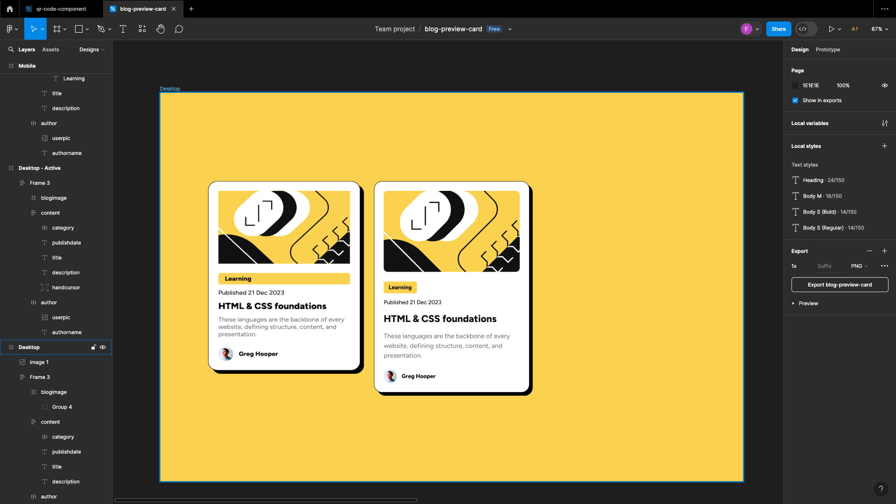

# Frontend Mentor - Blog preview card solution

This is a solution to the [Blog preview card challenge on Frontend Mentor](https://www.frontendmentor.io/challenges/blog-preview-card-ckPaj01IcS). Frontend Mentor challenges help you improve your coding skills by building realistic projects. 

## Table of contents

- [Overview](#overview)
  - [The challenge](#the-challenge)
  - [Screenshot](#screenshot)
  - [Links](#links)
- [My process](#my-process)
  - [Built with](#built-with)
  - [What I learned](#what-i-learned)
  - [Continued development](#continued-development)
- [Author](#author)


## Overview

### The challenge

Users should be able to:

- See hover and focus states for all interactive elements on the page

### Screenshot


### Links

- Solution URL: [https://github.com/fvdumah/Blog-Card]
- Live Site URL: [https://fvdumah.github.io/Blog-Card/]

### Built with

- Semantic HTML5 markup
- CSS custom properties
- Flexbox
- Mobile-first workflow


### What I learned

I've learnt how to apply flex gap to give equal spaces to flex children

```css
  main {
    display: flex;
    flex-direction: column;
    justify-content: space-between;
    gap: 1.5em;
  
  }
```

### Continued development

I want to learn how to make flex items take only the width of the element rather than being a block element. I struggled with the Learning Span taking full width when I only wanted it to take the space of it's content. It was caused by being a flex item. I tried adding a property of display: inline; to the span however it still took was a block element. 



## Author

- Website - [fvdumah](https://github.com/fvdumah)
- Frontend Mentor - [@fvdumah](https://www.frontendmentor.io/profile/fvdumah)
